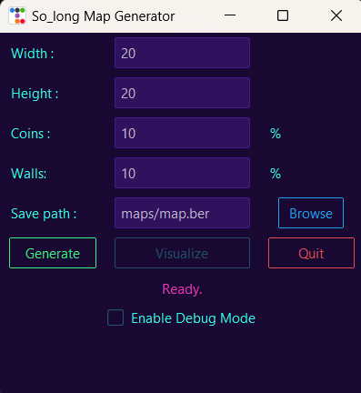
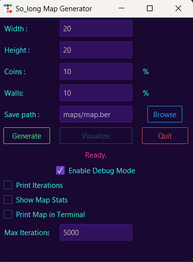
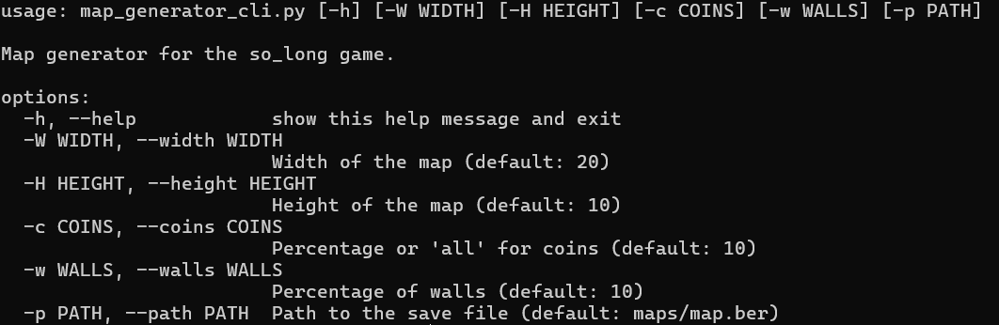

# Map Generator for the "so_long" Game

This project allows you to generate maps for the **so_long** game either via a graphical interface or through the command line. You can customize the map's dimensions, coin and wall percentages, and specify the save file location.

## Table of Contents

1. [Graphical Version](#graphical-version)
2. [Non-Graphical Version](#non-graphical-version)
3. [Improvement of File Names](#improvement-of-file-names)

---

## Graphical Version

The graphical version allows you to generate a map via a graphical user interface (GUI). You can input the width, height, coin and wall percentages, and display the generated map in a new window.

### Screenshot

Below is a screenshot of the graphical interface:



### Prerequisites

1. **Python 3.x** installed on your machine.
2. Install project dependencies, including those for the graphical interface.

```bash
pip install -r requirements-gui.txt
```

### Usage

Run the `map_generator_gui.py` script to open the graphical interface and generate a map.

```bash
python map_generator_gui.py
```

A window will appear where you can input the following parameters:

- **Width**: Map width (between 3 and 150).
- **Height**: Map height (between 3 and 150).
- **Coin percentage**: Coin percentage (between 0 and 100).
- **Wall percentage**: Wall percentage (between 0 and 99).
- **Save file path**: Path where the generated map will be saved.
- **Debug mode**: Enable debug mode to display the generated map in the console.

Once the parameters are defined, click "Generate" to create the map and display a success or failure message.

### Debug Mode



When the debug mode is enabled, the following additional options are available:

- **Iterations**: The number of iterations to attempt to generate a valid map.
- **Show Map**: Display the generated map in the console.
- **Max Iterations**: The maximum number of iterations to attempt to generate a valid map.
- **Stats**: Display the map generation statistics (number of coins, walls, and empty spaces).


### Main Code

The main logic is located in `map_generator_gui.py`, where you can interact with the GUI to generate a map.

---

## Non-Graphical Version

The non-graphical version allows you to generate a map directly from the command line without a graphical interface. You can specify the map's dimensions, coin percentage, and wall percentage.

⚠️ **Attention**

The non-graphical version has fewer security measures compared to the graphical version. Ensure that the input parameters are validated before running the script.



### Prerequisites

1. **Python 3.x** installed on your machine.
2. Install project dependencies (if applicable).

```bash
pip install -r requirements.txt
```

### Usage

To generate a map, run the `map_generator_cli.py` script with your desired parameters. By default, the values are:

- Width: 20
- Height: 10
- Coin percentage: 10
- Wall percentage: 10
- Save file path: `maps/map.ber`

#### Available Commands

```bash
python map_generator_cli.py -W 30 -H 15 -c 20 -w 30 -p "maps/custom_map.ber"
```

- `-W`, `--width`: Map width (between 3 and 150).
- `-H`, `--height`: Map height (between 3 and 150).
- `-c`, `--coins`: Coin percentage (between 0 and 100).
- `-w`, `--walls`: Wall percentage (between 0 and 99).
- `-p`, `--path`: Path to save the generated map file.

### Example

```bash
python map_generator_cli.py -W 50 -H 25 -c 15 -w 25 -p "maps/my_map.ber"
```

This command generates a 50x25 map with 15% coins and 25% walls, and saves it to `maps/my_map.ber`.

### Parameter Validation

The script validates the input parameters to ensure they meet the following requirements:

- Width and height must be between 3 and 150.
- Coin percentage must be between 0 and 100.
- Wall percentage must be between 0 and 99.
- If the map is 5x3 or 3x5, the wall percentage is automatically set to 0%.

### Main Code

The main logic is located in `map_generator_cli.py`, which uses the `main` function to generate and save the map in a `.ber` file. The map is generated until a valid map is produced.

---

## Need to fix
- [ ] The map generation algorithm is not efficient and may take a long time to generate a valid map for large dimensions.
- [ ] Folder creation for the save file path is not implemented.


## Contributing

If you'd like to contribute to the project, please fork the repository, make your changes, and submit a pull request.
